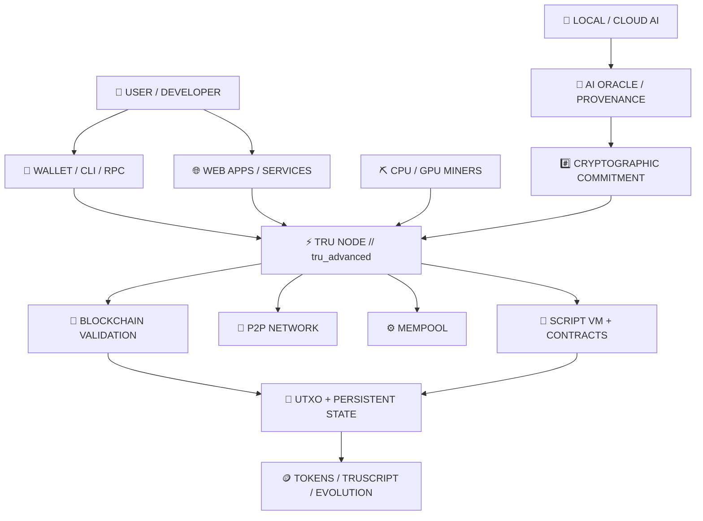

<div align="center">

# ⚡ TRU // TOKENIZED REAL UTILITY

### **UTXO OWNERSHIP · PROOF-OF-WORK SETTLEMENT · PROGRAMMABLE STATE · VERIFIABLE AI EVOLUTION**

**An independent Layer-1 blockchain built from the protocol up in C++17.**

TRU combines a Bitcoin-style UTXO ledger with native programmable assets, stateful contracts,  
TRUSCRIPT inscriptions, CPU/GPU mining, AI-proof anchoring, and evolving digital assets.

<br>

[](https://tokenizedrealutility.com)
[](https://tokenizedrealutility.com)
[](https://tokenizedrealutility.com)
[](https://tokenizedrealutility.com)
[](https://tokenizedrealutility.com)

<br>

### [`🌐 WEBSITE`](https://tokenizedrealutility.com) · [`🔎 EXPLORER`](https://tokenizedrealutility.com) · [`💻 REPOSITORIES`](https://github.com/TokenizedRealUtility?tab=repositories)

<br>

> **TRU is not an ERC-20 token, a sidechain, or a cosmetic fork.**  
> It runs its own blockchain, Proof-of-Work validation, UTXO ledger, mempool, P2P network, miners, wallets, script engine, token layer, AI anchoring stack, JSON-RPC interface, and explorer.

</div>

---

## `// NETWORK_IDENTITY`

```text
╔══════════════════════════════════════════════════════════════════════╗
║                     TOKENIZED REAL UTILITY                           ║
╠══════════════════════════════════════════════════════════════════════╣
║  CHAIN          TrueChain                                            ║
║  NATIVE ASSET   TRU                                                  ║
║  LEDGER         UTXO                                                 ║
║  CONSENSUS      Nakamoto Proof-of-Work                               ║
║  POW            SHA256d + 21E8                                       ║
║  TARGET         60-second blocks                                     ║
║  RETARGET       Every 60 blocks                                      ║
║  SUPPLY         21,000,000 TRU maximum                               ║
║  SUBSIDY        50 TRU initial block reward                          ║
║  HALVING        Every 210,000 blocks                                 ║
║  MINING         CPU + OpenCL GPU                                     ║
║  CORE           C++17                                                ║
╚══════════════════════════════════════════════════════════════════════╝
```

TRU is being built as a deterministic ownership, settlement, execution, and provenance layer for applications whose useful state extends beyond simple currency transfer.

---

# `01 // THE CHAIN`

TRU starts with a deliberately simple rule:

> **The blockchain decides ownership. Deterministic code decides validity. External systems may contribute information — but they do not get to redefine consensus.**

The network combines:

- **UTXO ownership** with explicit spend dependencies and deterministic state transitions
- **Nakamoto Proof-of-Work** with cumulative-work fork choice
- **Real secp256k1 ECDSA** transaction authorization
- **Mempool + P2P relay** with independent transaction validation
- **CPU and GPU mining** using the same Proof-of-Work puzzle as block validation
- **Persistent LevelDB state**
- **Native assets and inscriptions**
- **Stateful UTXO smart contracts**
- **Provider-independent AI anchoring**
- **Living Token Evolution**
- **JSON-RPC, CLI, GUI, web wallet, explorer, and Docker deployment**

---

# `02 // ARCHITECTURE`



TRU keeps the **consensus-critical path deterministic** while allowing applications to connect richer off-chain computation and data to verifiable on-chain commitments.

---

# `03 // NATIVE PROGRAMMABLE ASSETS`

TRU treats assets as first-class blockchain concepts rather than requiring every token system to exist as an external overlay.

| Layer | Native Capability | Purpose |
|---|---|---|
| 🪙 **FT** | Fungible Token | Utility units, rewards, digital currencies |
| 🧬 **SFT** | **Sentient Fungible Token** | Fungible assets with evolving / AI-oriented metadata |
| 🖼️ **NFT** | Non-Fungible Token | Unique ownership, certificates, collectibles, real-world assets |
| 🎨 **NCFT** | **Neural Canvas Fungible Token** | Dynamic media, AI-assisted art, evolving digital experiences |
| 📜 **TRUSCRIPT** | On-chain inscriptions | Text/data ownership, provenance, transfer history |
| 🧠 **Living Tokens** | Evolving token state | Cryptographically linked metadata epochs |
| 🔥 **Burn / Retirement** | Token retirement path | Permanently retire holdings while preserving chain history |

Token ownership remains tied to blockchain transactions and UTXO-funded state transitions.

---

# `04 // VERIFIABLE AI — NOT AI CONSENSUS`

TRU does **not** ask validators to run an LLM to decide whether a block is valid.

AI models are nondeterministic. Consensus cannot be.

Instead:

```text
          OFF-CHAIN COMPUTATION
                 │
                 ▼
        ┌──────────────────┐
        │   AI PROVIDER    │
        │ local / private  │
        │ cloud / custom   │
        └────────┬─────────┘
                 │
                 ▼
           AI RESPONSE
          /           \
         /             \
        ▼               ▼
  FULL STATE        SHA-256 DIGEST
  / METADATA             │
                         ▼
                 SIGNED TRU ANCHOR
                         │
                         ▼
                      MEMPOOL
                         │
                         ▼
                     PoW BLOCK
                         │
                         ▼
              VERIFIABLE CHAIN HISTORY
```

### Why this matters

The **model can change**.  
The **provider can change**.  
The **off-chain storage can change**.

The blockchain still preserves the cryptographic evidence connecting a specific state to a specific point in TRU history.

TRU's provider layer supports architectures using local/private models, custom endpoints, and cloud AI providers without placing nondeterministic inference inside Proof-of-Work consensus.

---

# `05 // LIVING TOKEN EVOLUTION`

A token on TRU does not have to remain a static metadata object forever.

Supported assets can evolve through cryptographically linked epochs:

```text
STATE_000
   │
   ├── hash
   ▼
STATE_001
   │
   ├── hash
   ▼
STATE_002
   │
   ├── hash
   ▼
STATE_003
   │
   ▼
CANONICAL ON-CHAIN EVOLUTION HISTORY
```

An evolution commitment can bind:

```text
TRU_EVOLVE_V1
├── tokenID
├── tokenType
├── epoch
├── provider
├── trigger
├── previous_metadata_hash
└── new_metadata_hash
```

This architecture creates a path for:

- autonomous or AI-assisted digital objects
- digital twins
- equipment and service histories
- evolving artwork
- game characters and persistent game assets
- AI-agent identity/state
- supply-chain objects
- adaptive memberships
- machine-learning provenance
- auditable AI-generated content history

---

# `06 // STATEFUL UTXO CONTRACTS`

TRU extends Bitcoin-style scripting without abandoning the UTXO ownership model.

```text
UTXO OWNERSHIP
      +
SCRIPT EXECUTION
      +
PERSISTENT CONTRACT STATE
      +
GAS METERING
      +
DETERMINISTIC CHAIN CONTEXT
```

The current contract engine includes capabilities such as:

- persistent `OP_STORE` / `OP_LOAD`
- ECDSA `CHECKSIG`
- ordered M-of-N multisignature validation
- gas-metered execution
- caller / contract execution context
- deterministic chain-state reads
- SHA3-256 and BLAKE2b-256
- transaction-aware execution
- contract-token primitives
- hash-lock and programmable-lock architecture

Some experimental opcodes and bridge paths remain intentionally incomplete and are not represented as production-ready features.

---

# `07 // MAGICLOCK`

TRU also includes a proof-conditioned UTXO primitive called **MagicLock**.

A normal UTXO asks:

```text
DO YOU CONTROL THE PRIVATE KEY?
```

A MagicLock can require:

```text
DO YOU CONTROL THE PRIVATE KEY?
              +
CAN YOU PRODUCE A VALID SIGNATURE
WHOSE HASH SATISFIES THE REQUIRED PREFIX?
```

This creates a native architecture for computational locks, proof challenges, game mechanics, delayed-effort spends, and experiments that combine cryptographic ownership with configurable computational work.

---

# `08 // MINING + NETWORK`

<div align="center">

**ONE CONSENSUS PUZZLE · MULTIPLE MINER IMPLEMENTATIONS · ONE CANONICAL CHAIN**

</div>

TRU supports:

- **Multithreaded CPU mining**
- **OpenCL GPU mining**
- network miner telemetry
- canonical block-producer history
- cumulative-work fork choice
- deterministic difficulty validation
- block-template construction
- P2P block and transaction propagation
- reorganization to the valid branch with greater accumulated work

### Current staged block profile

| Layer | Current staged limit |
|---|---:|
| Consensus block cap | **64 MiB** |
| Miner/template assembly budget | **56 MiB** |
| P2P framed payload cap | **80 MiB** |

Configured capacity is not presented as benchmarked sustainable throughput. TRU treats scaling as an engineering problem spanning validation, disk I/O, UTXO access, propagation, reorg behavior, and hardware diversity.

---

# `09 // THE TRU STACK`

```text
┌─────────────────────────────────────────────────────────────┐
│                    APPLICATION LAYER                        │
│ Web Wallet · Explorer · Bots · APIs · Developer Services    │
├─────────────────────────────────────────────────────────────┤
│                     ASSET LAYER                             │
│ FT · NFT · SFT · NCFT · TRUSCRIPT · Living Tokens           │
├─────────────────────────────────────────────────────────────┤
│                  PROGRAMMABILITY LAYER                      │
│ Script VM · Persistent State · Gas · Multisig · MagicLock   │
├─────────────────────────────────────────────────────────────┤
│                       NODE LAYER                            │
│ RPC · Mempool · Wallet · Mining · P2P · Storage             │
├─────────────────────────────────────────────────────────────┤
│                    CONSENSUS LAYER                          │
│ UTXO · SHA256d+21E8 · Cumulative Work · Block Validation    │
└─────────────────────────────────────────────────────────────┘
```

---

# `10 // BUILT FOR REAL UTILITY`

TRU's architecture is being developed for applications where **ownership, external state, computation, and provenance intersect**.

### Real-world asset records
Equipment, service rights, certificates, memberships, warranties, property-related records, and tracked physical assets.

### Digital twins
Machines, vehicles, equipment, or facilities represented by evolving digital objects whose state history can be cryptographically anchored.

### AI provenance
Generated text, media, analysis, machine decisions, or model-driven state can remain off-chain while a digest is permanently committed to TRU.

### Supply chains
Ownership changes, inspections, document hashes, events, and signed external commitments can be connected through the same asset history.

### Gaming + dynamic media
Persistent ownership and evolution histories can exist independently from a single game server or application backend.

---

# `11 // OPERATOR + DEVELOPER SURFACES`

TRU is more than a daemon.

The project includes:

```text
tru_advanced        → full node + interactive operator interface
tru-cli             → standalone JSON-RPC command client
CPU miner           → multithreaded Proof-of-Work
GPU miner           → OpenCL Proof-of-Work
HD wallet           → addresses, balances, signing, token operations
Qt GUI              → desktop graphical interface
Web Wallet          → browser wallet and asset interaction
Explorer            → blocks, transactions, addresses, miners, tokens, contracts
Docker              → repeatable node / miner deployment
```

The web stack is designed so private-key operations can remain local to the wallet while the public node exposes controlled read/build/broadcast interfaces.

---

# `12 // NETWORK PRINCIPLES`

### 🔐 Deterministic Consensus
Every validating node must be able to independently reach the same validity result.

### ⛏ Proof-of-Work Settlement
Canonical chain selection is based on accumulated valid work — not a trusted coordinator.

### 🧱 UTXO Ownership
Ownership transitions are explicit, inspectable, and cryptographically authorized.

### 🧬 Verifiable Evolution
Dynamic application state can evolve while preserving a cryptographic timeline.

### 🤖 AI Outside Consensus
AI contributes computation and metadata without becoming a nondeterministic consensus dependency.

### 🌐 Open Participation
Independent operators can run nodes and miners.

### 🚫 No Premine
No TRU supply was allocated before mining began.

### 🚫 No Presale
TRU was not launched through a token presale.

---

# `13 // IMPLEMENTATION SIGNAL`

### ✅ Implemented / operational in the current codebase

`UTXO Ledger` · `Nakamoto PoW` · `SHA256d + 21E8` · `CPU Mining` · `OpenCL GPU Mining` ·  
`Cumulative-Work Reorgs` · `ECDSA` · `Multisig` · `Persistent Contract State` · `Gas Metering` ·  
`FT` · `NFT` · `SFT` · `NCFT` · `TRUSCRIPT` · `AI Provider Layer` · `AI Anchoring` ·  
`Living Token Evolution` · `HD Wallet` · `Interactive CLI` · `tru-cli` · `Qt GUI` ·  
`JSON-RPC` · `Explorer` · `Docker`

### 🧪 Experimental / partial / future work

Generic external-data opcodes, delegated-signature logic, portions of contract-token functionality, bridge paths, independent consensus reimplementation, fully parallel validation, and next-generation streamed P2P framing remain areas of ongoing development.

> **TRU is an evolving independent blockchain.** Production users should review release notes, security notes, checksums, and upgrade requirements before operating software with real value.

---

# `14 // REPOSITORIES`

This GitHub profile is the canonical public home for the TRU open-source ecosystem.

Repositories will be clearly marked as:

```text
[ RELEASE ]       stable public release
[ PRODUCTION ]    deployed operational component
[ DEVELOPMENT ]   active engineering
[ EXPERIMENTAL ]  research / prototype
[ ARCHIVED ]      historical reference
```

### Explore the code

**[`github.com/TokenizedRealUtility`](https://github.com/TokenizedRealUtility)**

As repositories are published, this profile will become the index for:

- TRU Core
- CPU / GPU miners
- Explorer
- Web Wallet
- Developer tools
- Protocol documentation
- AI / evolution infrastructure
- specialized mining tools
- deployment resources

---

# `15 // OPEN-SOURCE NETWORK NOTICE`

<details>
<summary><b>Expand</b></summary>

<br>

TRU is free and open-source blockchain software.

The project is not conducting a token sale, ICO, presale, crowdfunding offering, investment program, or securities offering.

No purchase of TRU from the project is required to download, use, develop, validate, mine, or participate in the network.

The protocol does not provide holders with equity, dividends, revenue sharing, guaranteed yield, redemption rights, or promises of financial return.

Native TRU units are produced according to the public Proof-of-Work rules of the network.

Users are responsible for understanding the software and complying with laws and regulations applicable in their jurisdiction.

</details>

---

<div align="center">

# `BUILD // VERIFY // OWN // EVOLVE`

### **The chain records ownership.**
### **The protocol verifies state.**
### **Applications create utility.**
### **AI can evolve the asset — without becoming consensus.**

<br>

**TRU // TOKENIZED REAL UTILITY**

[`WEBSITE`](https://tokenizedrealutility.com) · [`EXPLORER`](https://tokenizedrealutility.com) · [`GITHUB`](https://github.com/TokenizedRealUtility)

<br>

`UTXO OWNERSHIP`  •  `PROOF-OF-WORK`  •  `PROGRAMMABLE STATE`  •  `VERIFIABLE AI`

</div>
